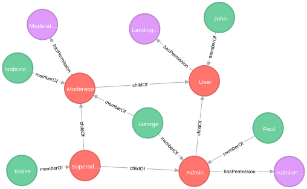

# Introduction
This code presents a simple integration of Vertx and Neo4j to provide RBAC with users, roles and permissions.



# How to run this example
1. Clone neo4vertx ```git clone https://github.com/raaftech/neo4vertx```
2. Install neo4vertx 2.0.0-SNAPSHOT into your local maven repository ```mvn install```
3. Run the ```com.github.meshuga.vertx.neo4j.acl.MainVerticle.main()``` from your IDE
4. Point your web browser to <http://localhost:7474/> to access Neo4j browser
5. Open <http://localhost:8080/init> to initialize the database
6. Open <http://localhost:8080/landingPage?userName=Blaise> or <http://localhost:8080/adminPage?userName=Nabucodonosor> to test the service